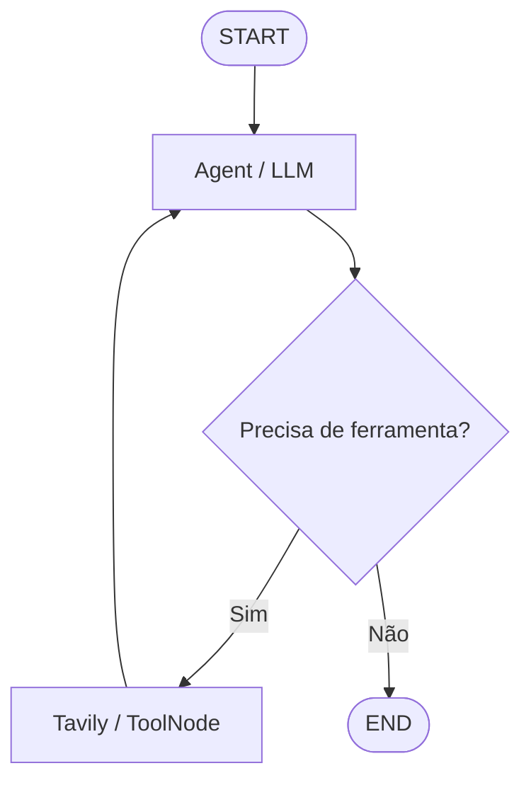

# Curso 1 — AI Agents in LangGraph

Projeto acadêmico e didático que demonstra a construção de um agente ReAct com
uma LLM servida pela Groq, busca web da Tavily e orquestração explícita pelo LangGraph.
O código foi organizado em etapas curtas e comentadas para facilitar a execução
e a apresentação no VS Code.

## Arquitetura

- **LangGraph:** orquestra o fluxo de execução.
- **LLM/Groq:** raciocina, escolhe quando usar a ferramenta e redige a resposta.
- **Tavily:** ferramenta externa que pesquisa informações atuais na web.
- **MessagesState:** memória de estado durante uma execução.
- **ToolNode:** executor das chamadas de ferramenta.
- **Arestas condicionais:** representam decisões tomadas a partir da saída da LLM.
- **Ciclo:** permite usar uma ferramenta e voltar à LLM para raciocinar novamente.



O estado compartilhado guarda todas as mensagens. O nó `agent` lê esse estado e
pode produzir uma resposta final ou um `tool_call`. A função `should_continue`
inspeciona a última mensagem e escolhe a próxima aresta. O nó `tools` executa a
busca e devolve o resultado ao estado. A aresta `tools → agent` fecha o ciclo.

## Fluxo ReAct

1. **Reasoning:** a LLM analisa a pergunta e o histórico.
2. **Action:** quando necessário, solicita a ferramenta Tavily.
3. **Observation:** o resultado da busca entra no histórico.
4. **Reasoning:** a LLM analisa a nova informação e decide o próximo passo.
5. **Final Answer:** quando possui informação suficiente, produz a resposta.

O raciocínio interno privado do modelo não é exibido. A demonstração mostra as
decisões observáveis: mensagens, chamadas de ferramenta, resultados e resposta.

## Requisitos

- Python 3.10 ou superior.
- VS Code com as extensões **Python** e **Jupyter**.
- Uma chave da API da Groq com acesso ao modelo configurado.
- Uma chave da API da Tavily.

## Instalação no Windows/PowerShell

Abra esta pasta no VS Code e, no terminal integrado, execute:

```powershell
python -m venv .venv
.\.venv\Scripts\Activate.ps1
python -m pip install --upgrade pip
python -m pip install -r requirements_curso1.txt
```

Confirme antes que `python --version` mostra Python 3.10 ou superior. Se houver
várias versões instaladas, escolha uma com `py -3.10 -m venv .venv`.

No VS Code, abra a paleta de comandos, escolha **Python: Select Interpreter** e
selecione o Python existente em `.venv`.

## Configuração das chaves

Copie o exemplo e crie seu arquivo local:

```powershell
Copy-Item .env.example .env
```

Edite `.env` e substitua apenas os valores:

```dotenv
GROQ_API_KEY=sua_chave_groq
TAVILY_API_KEY=sua_chave_tavily
GROQ_MODEL=llama-3.3-70b-versatile
```

O arquivo `.env` é ignorado pelo Git. Nunca publique nem cole suas chaves no
notebook, no código, em commits ou em capturas de tela. Você pode trocar o modelo
no `.env` caso sua conta não tenha acesso ao modelo de exemplo.

## Executar como arquivo Python no VS Code

O arquivo `curso1_langgraph_agente_busca.py` contém blocos `# %%`:

1. Abra o arquivo no VS Code.
2. Selecione o interpretador `.venv`.
3. Use **Run Cell** para executar os blocos na ordem, ou execute tudo no terminal:

```powershell
python curso1_langgraph_agente_busca.py
```

O programa imprime primeiro o Mermaid, tenta exibir uma imagem opcional, executa
a pergunta de teste, imprime a resposta final e depois detalha todo o histórico.

## Executar o notebook

1. Abra `curso1_langgraph_agente_busca.ipynb`.
2. Clique em **Select Kernel** e escolha `.venv`.
3. Execute as células na ordem com **Run All**.

A renderização PNG do grafo é opcional. Se ela falhar por conexão ou serviço de
renderização indisponível, o diagrama Mermaid ainda será mostrado e o agente
continuará funcional.

## Tratamento de erros

O projeto informa claramente quando há chave ausente, falha de autenticação ou
conexão, erro da Tavily e resposta final vazia. Erros da ferramenta voltam para a
LLM com seu tipo e mensagem para que ela não invente resultados. Exceções da LLM
são relançadas com contexto e preservam a causa original para diagnóstico.

## Arquivos

- `curso1_langgraph_agente_busca.ipynb`: demonstração principal em 13 células.
- `curso1_langgraph_agente_busca.py`: o mesmo fluxo em blocos interativos `# %%`.
- `requirements_curso1.txt`: dependências do ambiente.
- `.env.example`: nomes das variáveis, sem chaves reais.
- `.gitignore`: protege segredos e arquivos temporários.
- `README.md`: instalação, arquitetura e roteiro de execução.
