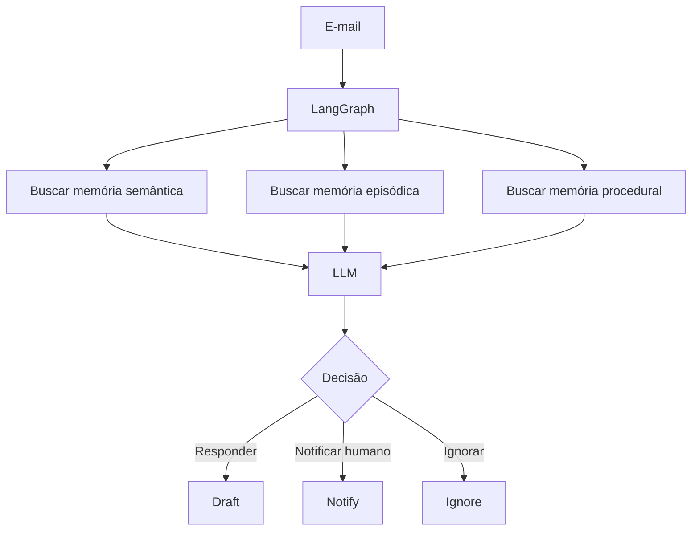

# Experimento 02 — Memória de Longo Prazo com LangGraph

Projeto acadêmico que demonstra um assistente de triagem de e-mails capaz de
recuperar fatos, experiências e regras armazenadas fora da LLM. O LangGraph
orquestra o fluxo, o Store fornece memória de longo prazo e o checkpointer mantém
o estado de curto prazo de cada conversa.

## Arquitetura



## Conceitos demonstrados

- **Memória semântica:** fatos e preferências; aquilo que o agente sabe.
- **Memória episódica:** casos anteriores e aprendizados; aquilo que aconteceu.
- **Memória procedural:** instruções; como o agente deve agir.
- **Short-term memory:** estado de uma thread, salvo pelo `InMemorySaver`.
- **Long-term memory:** dados externos à LLM, organizados no `InMemoryStore`.
- **Namespace:** separa memórias por `(user_id, tipo)`.
- **Embeddings:** transformam textos em vetores numéricos.
- **Busca semântica:** recupera memórias por significado, não só palavras iguais.
- **NumPy:** acelera as operações vetoriais usadas pelo Store em memória.
- **Feedback humano:** atualiza as regras procedurais e altera o comportamento.

A LLM não memoriza esses dados sozinha. Em cada execução, o LangGraph recupera
os itens relevantes e os inclui no contexto que será enviado ao modelo.

## `thread_id` x `user_id`

| Identificador | Escopo | Responsabilidade |
|---|---|---|
| `thread_id` | Uma conversa | Localiza os checkpoints e o estado de curto prazo. |
| `user_id` | Um usuário | Localiza memórias de longo prazo em diferentes threads. |

Assim, `thread-001` e `thread-002` possuem estados separados, mas recuperam as
mesmas preferências se ambas forem executadas com `usuario-demo`.

## Checkpointer x Store

| Componente | Conteúdo | Escopo |
|---|---|---|
| `InMemorySaver` | Snapshots do estado do grafo | Uma thread |
| `InMemoryStore` | Fatos, episódios e regras | Entre threads |

Neste experimento os dois componentes são voláteis: os dados somem quando o
processo termina. Em produção, pode-se usar um Store persistente, como
`PostgresStore`, além de um checkpointer persistente. PostgreSQL não é necessário
para esta demonstração.

## Requisitos

- Python 3.10 ou superior.
- VS Code com as extensões **Python** e **Jupyter**.
- Chave da API da Groq com acesso ao modelo configurado.

## Instalação

No terminal integrado do VS Code, dentro desta pasta:

```powershell
python --version
python -m venv .venv
.\.venv\Scripts\Activate.ps1
python -m pip install --upgrade pip
python -m pip install -r requirements.txt
```

## Configuração do `.env`

```powershell
Copy-Item .env.example .env
```

Edite `.env` e substitua o valor da chave:

```dotenv
GROQ_API_KEY=sua_chave_groq
GROQ_MODEL=llama-3.3-70b-versatile
```

O `.gitignore` impede que `.env` e o ambiente virtual sejam versionados. Nunca
publique a chave em código, notebook, commit ou captura de tela.

## Executar no VS Code

### Arquivo Python interativo

Abra `memoria_longo_prazo.py`, selecione o interpretador `.venv` e
use **Run Cell** nos blocos `# %%`, na ordem. Para executar tudo no terminal:

```powershell
python memoria_longo_prazo.py
```

### Notebook

1. Abra `memoria_longo_prazo.ipynb`.
2. Clique em **Select Kernel**.
3. Escolha **Python Environments** e o Python de `.venv`.
4. Execute **Run All** ou as células na ordem.

## O que observar na apresentação

1. O e-mail sobre cobrança recupera um episódio semanticamente parecido.
2. Uma nova `thread_id` mantém estado separado, mas o mesmo `user_id` recupera as
   mesmas memórias de longo prazo.
3. Uma preferência nova passa a aparecer nas buscas seguintes.
4. Um episódio novo influencia um caso semelhante posterior.
5. O feedback humano substitui as regras procedurais e faz e-mails financeiros
   serem classificados como `notify`.
6. A inspeção final mostra os três namespaces separadamente.

## Limitações e erros

O código trata chave ausente, Store vazio, falhas de embeddings, falhas de rede e
saída estruturada inválida. As exceções importantes preservam tipo e mensagem para
diagnóstico. Como o `InMemoryStore` é volátil, reiniciar o kernel recria a memória
do zero — comportamento esperado neste experimento didático.
