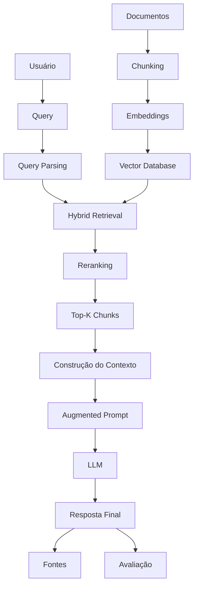

# Experimento 03 — Retrieval Augmented Generation (RAG)

Implementação acadêmica original de um pipeline RAG completo para a empresa
fictícia TechService Brasil. O projeto demonstra ingestão, chunking, embeddings,
busca semântica e lexical, retrieval híbrido, reranking, geração fundamentada,
fontes, avaliação e latência.

## Arquitetura



## Vector database e decisão sobre Weaviate

O Weaviate Embedded foi avaliado, mas a documentação oficial o classifica como
experimental e suporta seu binário embedded somente em Linux e macOS. O Weaviate
também não oferece execução nativa no Windows; Docker ou WSL seriam necessários.

Para que o experimento rode diretamente no VS Code deste Windows, foi implementado
`LocalVectorDatabase`: ele armazena texto, embedding e metadata, e consulta vetores
por similaridade cosseno com NumPy/scikit-learn. O fluxo conceitual é o mesmo:

```text
texto → embedding → vetor → vector database → similaridade → chunks relevantes
```

Em produção, a classe local pode ser substituída por Weaviate via Docker, WSL ou
Weaviate Cloud, mantendo as etapas de ingestão e retrieval.

## Conceitos

- **Documentos/loaders:** leitura dos `.txt` com metadata de origem e categoria.
- **Chunking:** `RecursiveCharacterTextSplitter` com sobreposição de contexto.
- **Vetores locais:** hashing determinístico representa os termos sem chamar outra API.
- **Semantic search:** similaridade cosseno entre pergunta e chunks.
- **Keyword search:** BM25 valoriza termos literais raros.
- **Hybrid search:** combina scores normalizados com `alpha` configurável.
- **Query parsing:** structured output identifica intenção, termos e produto.
- **Retriever/reranking/top-k:** seleciona e reordena o contexto mais útil.
- **Augmented prompt:** pergunta mais conhecimento recuperado.
- **Grounded generation:** a resposta deve usar somente o contexto e citar fontes.
- **Avaliação:** retrieval e geração são medidos separadamente.
- **Latência/custo:** mais etapas podem melhorar qualidade, mas consomem tempo e API.

## Dados

`data/` contém três arquivos totalmente fictícios: dados institucionais, catálogo
de produtos e políticas. Eles existem apenas para laboratório e não descrevem uma
empresa real.

## Instalação

```powershell
python --version
python -m venv .venv
.\.venv\Scripts\Activate.ps1
python -m pip install --upgrade pip
python -m pip install -r requirements_03_rag.txt
```

É necessário Python 3.10 ou superior e as extensões Python/Jupyter do VS Code.

## Configuração

```powershell
Copy-Item .env.example .env
```

Depois, edite `.env`:

```dotenv
GROQ_API_KEY=sua_chave_groq
GROQ_MODEL=llama-3.3-70b-versatile
```

Nunca publique o `.env`. Query parsing e geração usam a Groq e podem gerar custo
conforme a conta; os vetores de busca são gerados localmente por hashing determinístico.

## Execução

Arquivo Python:

```powershell
python 03_rag_completo.py
```

No VS Code, abra primeiro `03_rag_completo.ipynb`, clique em **Select Kernel** e
escolha `.venv`. Execute as células na ordem. O `.py` possui os mesmos blocos em
formato `# %%` e também pode ser executado interativamente com **Run Cell**.

## Testes e apresentação

Os exemplos incluem pergunta direta, equivalência semântica, palavra-chave, busca
híbrida, pergunta sem resposta e comparação sem/com RAG. As células mais úteis na
apresentação são: chunking (9–10), indexação (11), buscas (12–15), pipeline (22),
comparação (25), avaliações (26–27) e debug completo (29).

Sem RAG, a LLM não conhece necessariamente a empresa fictícia. Com RAG, os dados
são recuperados e inseridos no contexto, reduzindo alucinações. Recuperar muitos
chunks aumenta ruído e custo; recuperar poucos pode omitir informação.

## RAG x fine-tuning x MCP

- RAG fornece conhecimento no momento da consulta.
- Fine-tuning altera comportamento/parâmetros por treinamento.
- MCP padroniza o acesso a ferramentas, APIs e sistemas.

RAG e MCP podem coexistir em um agente: o primeiro busca conhecimento documental;
o segundo conecta o agente a capacidades externas.
