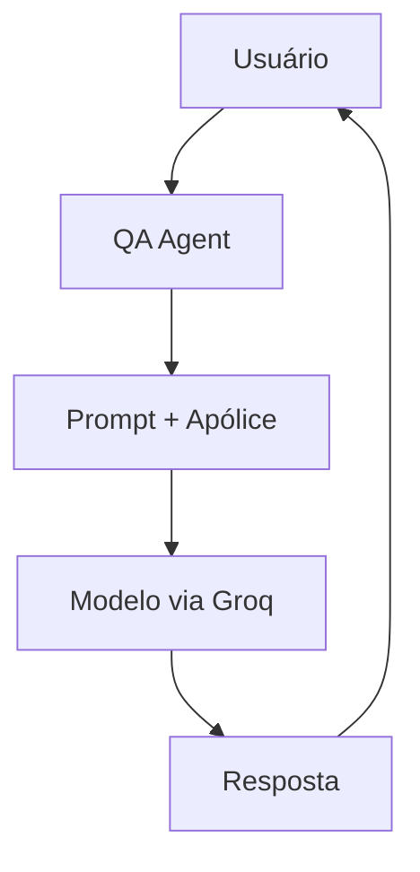
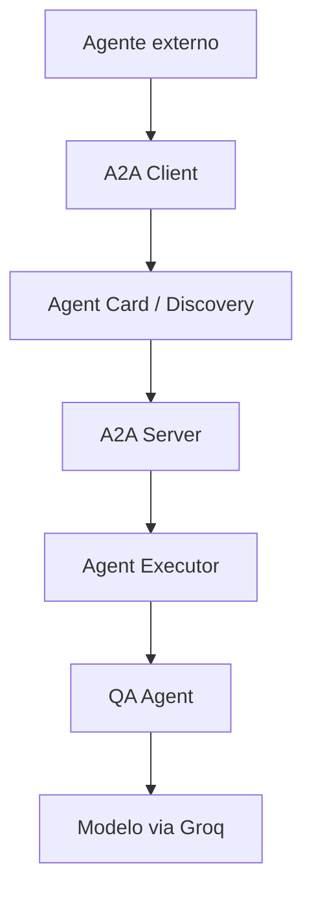

# Experimento 04 — A2A / QA Agent com Groq

Projeto acadêmico inspirado conceitualmente em um QA Agent do curso **A2A: The Agent2Agent Protocol**, agora migrado para Groq. A pasta histórica se chama `04-acp-protocolo`, mas o protocolo estudado é **A2A — Agent2Agent Protocol**.

Nesta etapa construímos somente o agente especializado. Não há servidor A2A, `AgentExecutor`, Agent Card nem cliente A2A. Uma camada A2A futura poderá reutilizar `agent.answer(question)` sem incorporar a lógica da Groq ao transporte.

## O que cada componente faz

- **Groq:** infraestrutura de inferência usada para acessar o modelo.
- **Modelo:** interpreta a apólice e produz a resposta.
- **QA Agent:** lógica especializada da aplicação: instruções, contexto, validação e chamada ao modelo.
- **A2A:** protocolo que futuramente permitirá descoberta e comunicação padronizada entre agentes.

## Arquitetura atual



## Arquitetura futura



O protocolo A2A não realiza o raciocínio do agente: ele padroniza como outros agentes o descobrem e se comunicam com ele.

## Compatibilidade verificada

A implementação usa o [SDK Python da Groq](https://console.groq.com/docs/text-chat) e Chat Completions. O modelo vem de `GROQ_MODEL`, permitindo trocar o modelo sem editar o código.

O [SDK Python oficial do A2A](https://github.com/a2aproject/a2a-python) usa atualmente o pacote `a2a-sdk` e a abstração `AgentExecutor`. Esse pacote não está nos requisitos deste experimento porque o servidor A2A ainda não foi implementado e nenhuma parte do código o importa.

## Pré-requisitos

- Python 3.10 ou superior;
- uma chave Groq válida no `.env` da raiz;
- acesso ao modelo indicado por `GROQ_MODEL`.

## Instalação no PowerShell

Abra esta pasta no VS Code e execute:

```powershell
py -3.10 -m venv .venv
.\.venv\Scripts\Activate.ps1
python -m pip install --upgrade pip
python -m pip install -r requirements_04_a2a.txt
python -m ipykernel install --user --name experimento-04-a2a --display-name "Python (Experimento 04 A2A)"
```

Se o comando `py -3.10` não existir, use uma instalação disponível de Python 3.10+:

```powershell
python -m venv .venv
```

No VS Code, selecione o interpretador `.venv` ou o kernel **Python (Experimento 04 A2A)**.

## Autenticação com ADC

O projeto usa **Application Default Credentials**. Faça login sem copiar tokens ou arquivos de credencial para a pasta:

```powershell
gcloud auth application-default login
```

Opcionalmente, selecione o projeto no CLI:

```powershell
gcloud config set project SEU_PROJECT_ID
```

O código usa `google.auth.default()` apenas para confirmar a disponibilidade das credenciais e mostra somente se elas existem e qual projeto foi detectado. Tokens e objetos de credencial nunca são impressos nem salvos.

## Configuração

Crie o arquivo local `.env` a partir do exemplo:

```powershell
Copy-Item .env.example .env
```

Edite-o:

```dotenv
GROQ_API_KEY=cole_sua_chave_aqui
GROQ_MODEL=llama-3.3-70b-versatile
RUN_LIVE_DEMOS=false
```

Use em `GROQ_MODEL` um identificador presente na lista de modelos disponível para sua conta Groq.

Não adicione `.env`, service accounts, tokens ou JSONs de credencial ao Git. O `.gitignore` usa padrões específicos para credenciais e não ignora indiscriminadamente todos os arquivos JSON.

## Execução segura e custo

Abra [01_qa_agent_claude_vertex.ipynb](./01_qa_agent_claude_vertex.ipynb). Por padrão, `RUN_LIVE_DEMOS=false`; assim, executar todas as células faz as validações locais, mas não envia perguntas pagas ao modelo.

Para fazer uma demonstração real, após conferir projeto, ADC e acesso ao modelo, altere temporariamente no notebook:

```python
RUN_LIVE_DEMOS = True
```

Em seguida, execute somente a célula de teste desejada. Evite **Run All** com essa opção ativa: o notebook contém nove chamadas didáticas ao todo (teste básico, testes da apólice, grounding e teste adversarial).

A versão em células Python também pode ser aberta no VS Code:

```powershell
python .\01_qa_agent_claude_vertex.py
```

Com a configuração padrão ela não realiza chamadas remotas. Se `RUN_LIVE_DEMOS=true` estiver no `.env`, o script executará o conjunto de demonstrações; use essa opção conscientemente.

## Testes didáticos

As células cobrem:

1. resposta direta: valor da franquia;
2. interpretação combinada: carro reserva e despesas não cobertas;
3. ausência de informação: cobertura médica em viagem internacional;
4. resistência básica a prompt injection: tentativa de trocar a franquia por R$ 100;
5. várias perguntas consecutivas.

O teste de grounding verifica se o agente reconhece a falta de suporte documental. A defesa adversarial usa separação entre system prompt, apólice e pergunta, mas não deve ser entendida como garantia absoluta contra todas as formas de prompt injection.

## Latência e logs

A função `answer_with_metrics()` usa `time.perf_counter()` e mostra modelo, região, duração e tamanho aproximado do contexto em caracteres. Ela não imprime credenciais. O exemplo permanece comentado para não criar custo por acidente.

## Tratamento de erros

O código diferencia mensagens para:

- projeto, região ou modelo ausente;
- ADC ausente;
- arquivo da apólice inexistente ou vazio;
- falha de autenticação;
- permissão/IAM ou acesso ao Model Garden;
- quota ou limite de requisições;
- modelo inexistente ou incompatível com a região;
- conexão e outros status HTTP do serviço;
- resposta sem blocos de texto.

A exceção original é preservada como causa (`raise ... from error`) para facilitar o diagnóstico no VS Code.

## Saída estruturada opcional

`QAResponse` demonstra validação local com Pydantic (`answer`, `found_in_policy` e `evidence`). O fluxo principal usa texto para evitar acoplamento a capacidades específicas de structured output do provedor. Se a opção for adotada depois, o aplicativo deve solicitar JSON e validá-lo antes de usar os campos.

## Preparação para A2A

O ponto de integração futuro é simples:

```python
answer = agent.answer(question)
```

Um futuro `AgentExecutor` receberá a mensagem A2A, extrairá a pergunta, chamará esse método e traduzirá a resposta de volta para o protocolo:

```text
Transport / A2A
       ↓
Agent Executor
       ↓
Business Agent
       ↓
Groq
```

**Primeiro construímos um agente especializado. Depois ele pode virar um serviço interoperável usando A2A.**

## Arquivos

```text
04-acp-protocolo/
├── 01_qa_agent_claude_vertex.ipynb
├── 01_qa_agent_claude_vertex.py
├── requirements_04_a2a.txt
├── .env.example
├── .gitignore
├── README.md
└── data/
    └── insurance_policy.txt
```

O arquivo preexistente `main.py` foi preservado e não faz parte deste novo fluxo de QA.
