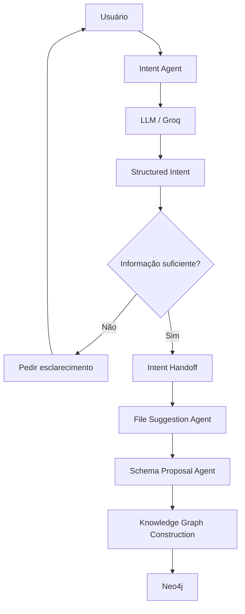
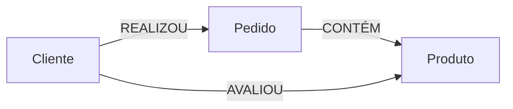

# Experimento 05 — Agentic Knowledge Graph Construction

## 05.1 — Understanding User Intent

Projeto acadêmico e original, inspirado conceitualmente no curso **Agentic Knowledge Graph Construction**. Esta primeira etapa transforma uma solicitação em linguagem natural em uma intenção estruturada. Ela não constrói o grafo, não define o schema final, não executa Cypher e não se conecta ao Neo4j.

> O Knowledge Graph não começa no Neo4j. Ele começa entendendo quais perguntas o usuário quer responder.

## Responsabilidade desta etapa

```text
Usuário
   ↓
Intent Agent
   ↓
UserIntent estruturado
   ↓
Próximos agentes
```

O `UserIntent` registra objetivo, domínio, perguntas de negócio, entidades e relacionamentos candidatos, dados necessários, restrições, ambiguidades, perguntas de esclarecimento, prontidão e um indicador didático de confiança.

Entidades e relacionamentos ainda são hipóteses. O Intent Agent pode interpretar “Cliente compra Produto”, mas somente o futuro Schema Agent decidirá entre uma relação direta ou uma estrutura intermediada por Pedido.

## Arquitetura planejada





Sequência didática:

- Experimento 05.1: Understanding User Intent;
- experimento futuro 05.2: File Suggestions;
- experimento futuro 05.3: Schema Proposal;
- experimento futuro 05.4: Knowledge Graph Construction.

## APIs atuais

O projeto usa `google.adk.agents.Agent`, `Runner`, `InMemorySessionService`, `output_schema` e `output_key`. O adaptador `LiteLlm` conecta o ADK à Groq sem mudar a arquitetura do agente. Consulte a [documentação de agentes LLM do ADK](https://google.github.io/adk-docs/agents/llm-agents/) e a [integração LiteLLM](https://google.github.io/adk-docs/agents/models/litellm/).

O modelo padrão é `llama-3.3-70b-versatile`; ele pode ser alterado em `GROQ_MODEL` para outro modelo disponível na sua conta.

As versões não foram fixadas arbitrariamente no requirements. O código usa APIs públicas verificadas, e o README registra a versão usada nos testes locais.

## Pré-requisitos

- Python 3.10 ou superior;
- uma chave Groq válida no `.env` da raiz.

Neo4j não é necessário nesta etapa.

## Ambiente virtual e instalação

No PowerShell:

```powershell
cd "C:\Users\denil\Downloads\LLMS - agentes IA\LLMs Agentes IA\experiments\05-grafo-conhecimento"
py -3.10 -m venv .venv
.\.venv\Scripts\Activate.ps1
python -m pip install -r requirements_05_knowledge_graph.txt
python -m ipykernel install --user --name experimento-05-kg --display-name "Python (Experimento 05 KG)"
```

Se `py -3.10` não estiver disponível, use outro Python 3.10+ com `python -m venv .venv`.

## Configuração com Groq

Crie o `.env` local:

```powershell
Copy-Item .env.example .env
```

Edite sem compartilhar a chave:

```dotenv
GROQ_API_KEY=sua-chave-real
GROQ_MODEL=llama-3.3-70b-versatile
RUN_LIVE_DEMOS=false
```

Nunca imprima a chave, grave-a no notebook ou faça commit do `.env`.

## Notebook e custo

Abra [01_understanding_user_intent.ipynb](./01_understanding_user_intent.ipynb) no VS Code e selecione o kernel da `.venv`.

Execute primeiro as células 1–10. Com `RUN_LIVE_DEMOS=false`, elas carregam configuração, modelos Pydantic, agente e runner, mas não chamam a Groq. Para uma demonstração real, depois de validar a chave, defina deliberadamente:

```python
RUN_LIVE_DEMOS = True
```

Execute apenas a célula de teste desejada. Não use **Run All** com essa opção ativa: as células incluem testes de diferentes domínios, clarification loop e avaliação, e cada análise gera uma chamada.

A versão Python em células do VS Code também está disponível:

```powershell
python .\01_understanding_user_intent.py
```

Sem `RUN_LIVE_DEMOS=true`, o script realiza somente validações locais.

## Células mais importantes para a apresentação

- 3: por que dados não definem sozinhos o grafo;
- 7: modelo `UserIntent`;
- 8: responsabilidade e guardrails do Intent Agent;
- 9–10: `Agent`, structured output, `Runner` e sessão;
- 11–14: intenção completa, incompleta e clarification loop;
- 15: diferença entre intenção e schema;
- 17–18: ambiguidade e guardrails;
- 19–21: estado temporário e handoff estruturado;
- 22–24: arquitetura, Neo4j futuro e comparação com RAG;
- 26: avaliação didática;
- 27: resumo acadêmico.

## Clarification loop

Quando uma solicitação é vaga, o agente deve retornar `ready_for_next_step=false`, registrar ambiguidades e formular perguntas. `merge_clarification()` junta a solicitação original à resposta posterior do usuário e solicita uma nova análise, preservando a responsabilidade do agente.

## Structured output e handoff

O ADK recebe `output_schema=UserIntent`. A aplicação ainda valida o resultado com Pydantic e apresenta erros específicos para resposta vazia ou schema inválido.

`IntentHandoff` transporta:

- solicitação original;
- intenção validada;
- `suggest_files` quando há informação suficiente; ou
- `request_clarification` quando ainda há ambiguidades essenciais.

Assim, agentes trocam objetos estruturados em vez de prompts gigantes.

## Sessão

O `output_key="current_intent"` grava a saída na sessão. O exemplo também mantém domínio, respostas de esclarecimento e decisão de prontidão. `InMemorySessionService` é um workspace temporário da execução atual; não é memória de longo prazo e desaparece quando o processo termina.

## Dados fictícios

Os CSVs contêm oito clientes sintéticos, oito produtos e quinze pedidos. `avaliacoes.txt` contém avaliações inventadas. Nenhum registro representa pessoa, compra ou opinião real. Esses arquivos serão candidatos de entrada para o futuro File Suggestion Agent; o Intent Agent atual não os acessa automaticamente.

## Guardrails

O prompt instrui o agente a não inventar entidades sem base, não definir schema final, não executar Cypher, não criar dados, não acessar arquivos sem autorização e não assumir o significado de expressões como “clientes mais importantes”. Essa é uma separação de responsabilidade, não uma garantia absoluta de segurança contra qualquer entrada adversarial.

## Tratamento de erros

Há mensagens específicas para:

- chave Groq ausente;
- intenção vazia;
- modelo inválido ou indisponível;
- autenticação, permissão e quota;
- falha da API Groq/ADK;
- resposta vazia;
- JSON estruturado ou validação Pydantic inválidos;
- sessão inexistente.

Ambiguidade legítima não é tratada como exceção: ela deve aparecer em `ambiguities`, produzir perguntas e normalmente resultar em `ready_for_next_step=false`.

## Knowledge Graph e RAG

RAG tradicional recupera chunks por similaridade, enquanto um Knowledge Graph torna entidades e relações explícitas. Eles podem ser combinados; este projeto não afirma que um substitui o outro.

## Estrutura

```text
05-grafo-conhecimento/
├── 01_understanding_user_intent.ipynb
├── 01_understanding_user_intent.py
├── requirements_05_knowledge_graph.txt
├── .env.example
├── .gitignore
├── README.md
└── data/
    ├── clientes.csv
    ├── pedidos.csv
    ├── produtos.csv
    └── avaliacoes.txt
```

O `main.py` preexistente foi preservado e não pertence ao novo fluxo do Intent Agent.

> O Intent Agent entende o problema; o File Suggestion Agent identifica fontes; o Schema Agent propõe a estrutura; e o Construction Agent materializa o grafo.
