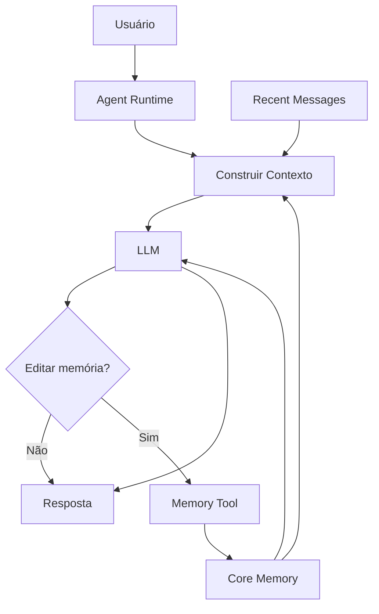
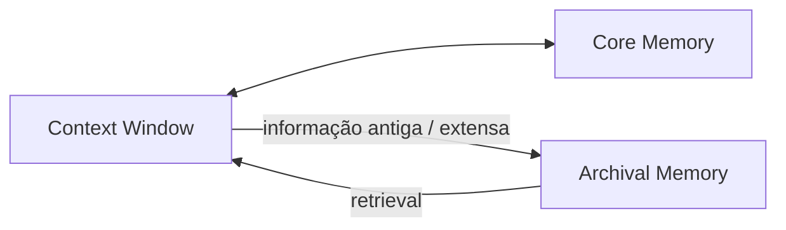

# Experimento 06 — Gerenciamento de Contexto

## 06.1 — Editable Memory

Implementação acadêmica original inspirada nos conceitos de **LLMs as Operating Systems: Agent Memory / Editable Memory**. O experimento demonstra que memória de agente é estado persistente fora do modelo; não é alteração dos pesos da LLM.

## Ideia central

Uma LLM recebe uma context window. O `ContextMemoryAgent` acrescenta estado, blocos editáveis, ferramentas, mensagens recentes, memória arquivada e persistência. O runtime decide qual informação chegará ao modelo.





## Componentes

- `MemoryBlock`: label, descrição, valor, limite e proteção read-only;
- `EditableMemoryManager`: leitura, update, append, replace, delete e renderização;
- `ContextMemoryAgent`: loop controlado de tool calling pela Chat Completions API;
- core memory: `persona`, `human`, `project` e `scratchpad`;
- `ArchivalMemory`: busca lexical local com similaridade baseada em tokens;
- persistência JSON local em `agent_memory.json`, ignorado pelo Git;
- integração opcional com Letta.

O exemplo usa o SDK nativo da Groq com Chat Completions e tool calling. O loop mantém JSON Schema, execução das funções pela aplicação e resultados ligados pelo `tool_call_id`.

O SDK oficial atual do Letta é `letta-client`; ele oferece `Letta`, `memory_blocks` e endpoints de blocos por agente. Consulte a [documentação Python do Letta](https://docs.letta.com/api/python) e [Memory Blocks](https://docs.letta.com/v1-sdk/memory/memory-blocks). O SDK não está marcado como legado; APIs antigas do curso não foram reutilizadas.

## Instalação

```powershell
cd "C:\Users\denil\Downloads\LLMS - agentes IA\LLMs Agentes IA\experiments\06-gerenciamento-contexto"
py -3.10 -m venv .venv
.\.venv\Scripts\Activate.ps1
python -m pip install -r requirements.txt
```

Letta é opcional:

```powershell
python -m pip install letta-client
```

## Configuração

```powershell
Copy-Item .env.example .env
```

```dotenv
GROQ_API_KEY=sua-chave-real
GROQ_MODEL=llama-3.3-70b-versatile
RUN_LIVE_DEMOS=false

LETTA_API_KEY=
LETTA_MODEL=groq/llama-3.3-70b-versatile
```

Nunca faça commit do `.env`, imprima chaves ou permita que ferramentas editem blocos read-only.

## Execução segura

Abra `memoria_editavel.ipynb` no VS Code. Execute primeiro as células 1–14; com `RUN_LIVE_DEMOS=false`, nenhuma chamada remota ocorre. Para uma demonstração real, configure a chave, defina `RUN_LIVE_DEMOS=True` e execute somente a célula desejada. O loop aceita no máximo cinco rodadas de ferramentas.

Também é possível usar as células `# %%`:

```powershell
python .\memoria_editavel.py
```

## Células principais para o professor

- 7–10: blocos, manager, seed e tabela;
- 12–14: system prompt, tools e loop Groq;
- 15–17: aprender, utilizar e substituir preferência;
- 21–23: decisão estruturada, debug e tamanho do contexto;
- 24–25: limite e compactação;
- 26–30: core/archival, paging, recuperação e persistência;
- 31–33: Letta opcional e self-editing memory;
- 34–39: estado, gerenciamento de contexto e comparações;
- 40–41: avaliação e resumo.

## MemGPT e analogia de sistema operacional

Context window é comparada à memória rápida, limitada e cara; memória externa é maior, persistente e recuperada sob demanda. Essa é uma analogia de gerenciamento de recursos, não equivalência técnica entre LLM e sistema operacional.

```text
                    AGENT
        System Prompt + Core Memory
                      ↓
               Context Window
                      ↓
                     LLM
                      ↓
                 Tool Calling
                ↙            ↘
        Memory Update     Memory Search
              ↓               ↓
         Core Memory     Archival Memory
```

## Memória, histórico e RAG

Histórico registra eventos; memória seleciona fatos reutilizáveis. Editable Memory mantém estado vivo sobre persona, usuário e projeto. RAG recupera conhecimento de documentos. Podem coexistir. Letta/MemGPT enfatiza agentes persistentes e self-editing memory; LangGraph Store pode servir como infraestrutura de persistência em workflows, sem substituir integralmente essa arquitetura.

## Compactação e contexto

O manager nunca trunca silenciosamente. Ao exceder um limite, levanta erro claro. `compact_memory_block()` solicita à LLM uma versão menor preservando fatos, preferências, restrições e decisões, e valida novamente o tamanho. A contagem didática usa caracteres e estimativa aproximada de um token para quatro caracteres.

## Persistência

`save_memory()` grava blocos e arquivo externo; `load_memory()` restaura o estado após reinício. O arquivo real `agent_memory.json` está no `.gitignore`. O teste local usa um arquivo temporário e o remove ao concluir.

## Tratamento de erros

Há mensagens para chave ausente, bloco inexistente/read-only, limite excedido, JSON inválido, persistência, resposta vazia, erro Groq, erro Letta, mensagem vazia e excesso de tool calls.

## Estrutura

```text
06-gerenciamento-contexto/
├── memoria_editavel.ipynb
├── memoria_editavel.py
├── requirements.txt
├── .env.example
├── .gitignore
├── README.md
└── data/
    └── memory_seed.json
```

O `main.py` preexistente foi preservado.
