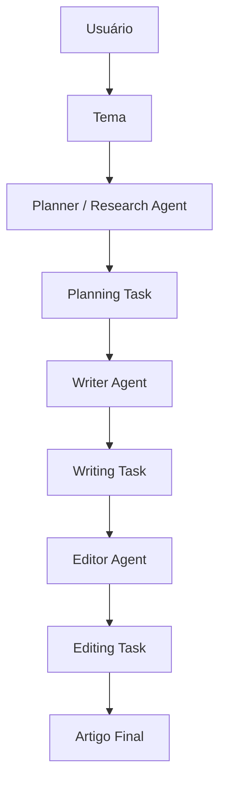
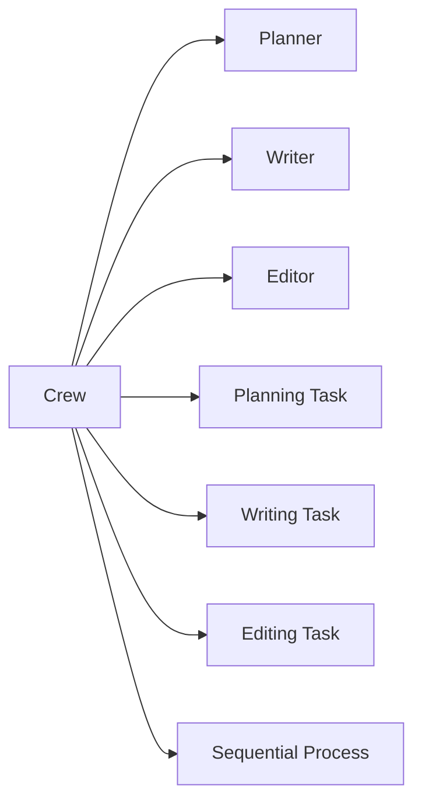

# Experimento 07 — Multiagentes com CrewAI

## 07.1 — Research and Write an Article

Projeto acadêmico e original para demonstrar como uma tarefa ampla pode ser
decomposta entre três agentes especializados: Planejador/Pesquisador, Redator e
Editor. O exemplo usa a API atual do CrewAI e Groq como provedora da LLM.

> CrewAI permite organizar uma equipe de agentes especializados. Cada agente possui
> papel, objetivo e responsabilidade; as Tasks definem o trabalho e o Process define
> como as tarefas são executadas.

O tema padrão é **“Como sistemas multiagentes podem melhorar processos
empresariais”**, mas qualquer texto pode ser passado em `TOPIC` ou para `run_crew()`.

## Arquitetura





No processo sequencial, `planning_task` entra em `context=[planning_task]` da
tarefa de escrita; depois `writing_task` entra no contexto da edição. Colaboração
não significa necessariamente simultaneidade: a saída de uma etapa pode alimentar
a próxima de maneira explícita.

## Conceitos demonstrados

- `Agent`: o especialista que executa trabalho.
- `role`: quem é o agente.
- `goal`: o resultado que ele busca.
- `backstory`: instruções que contextualizam experiência e conduta; não é memória.
- `Task`: a unidade de trabalho, associada a um agente.
- `expected_output`: formato e qualidade esperados.
- `Crew`: equipe que reúne agentes e tarefas.
- `Process.sequential`: ordem Planejamento → Redação → Edição.
- contexto: ligação explícita entre os outputs das Tasks.

Todos os agentes usam o mesmo `GROQ_MODEL`. A especialização vem de papéis,
objetivos, instruções, ferramentas e tarefas diferentes, não da obrigação de usar
modelos distintos.

## Preparação no VS Code

No PowerShell, dentro desta pasta:

```powershell
py -3.10 -m venv .venv
.\.venv\Scripts\Activate.ps1
python -m pip install --upgrade pip
pip install -r requirements.txt
python -m ipykernel install --user --name 07-multiagentes --display-name "Python (07-multiagentes)"
```

Python 3.10 ou superior é necessário. Se `py -3.10` não estiver instalado, use a
versão disponível, por exemplo `py -3.12`.

Crie a configuração local:

```powershell
Copy-Item .env.example .env
```

Edite `.env` sem compartilhar a chave:

```dotenv
GROQ_API_KEY=cole_sua_chave_aqui
GROQ_MODEL=llama-3.3-70b-versatile
SERPER_API_KEY=
```

O modelo é trocado somente em `GROQ_MODEL`. Disponibilidade, limites e cobrança
dependem da conta Groq usada.

## Executar

Abra `sistema_multiagentes.ipynb`, selecione o kernel
**Python (07-multiagentes)** e execute as células em ordem. A célula 16 é a primeira
que faz a execução real e potencialmente paga:

```python
result = crew.kickoff(inputs={"topic": TOPIC})
```

O notebook inclui 45 células. Para uma apresentação curta, priorize:

1. células 1–2: motivação e LLM única × multiagentes;
2. células 7–14: agentes, Tasks, contexto e Crew;
3. células 16–19: execução, resultado e outputs intermediários;
4. células 28–35: contexto, ferramenta opcional, custo, latência e guardrail;
5. células 42–45: avaliação, debug, diagrama e síntese acadêmica.

Também é possível executar o script:

```powershell
python sistema_multiagentes.py
```

Importar o arquivo não chama APIs. Executar o script ou a célula 16 com uma chave
válida chama a Crew. A função `single_llm_article(topic)` da célula 31 é uma
comparação opcional e só chama a Chat Completions API quando invocada explicitamente.

O estado interno do CrewAI é gravado em `.crewai-data/` na raiz do repositório.
Essa pasta é criada automaticamente e ignorada pelo Git, evitando falhas de acesso
ao banco SQLite na pasta global do usuário.

## Outputs

A célula 35 cria, depois de uma execução real:

- `output/plano.md`;
- `output/draft.md`;
- `output/artigo_final.md`.

Esses Markdown são ignorados pelo Git; `output/.gitkeep` preserva a pasta. Sem uma
execução real, nenhum conteúdo de exemplo é inventado nem salvo.

## Pesquisa web opcional

O fluxo principal funciona sem Serper. Se `SERPER_API_KEY` estiver preenchida,
`SerperDevTool` é adicionada somente ao Planner; Writer e Editor continuam sem
ferramentas, seguindo o princípio de menor privilégio. O extra `crewai[tools]` nos
requisitos fornece essa integração. A pesquisa pode gerar custo e latência externos.

## Custos, latência e qualidade

Uma Crew com três agentes pode fazer várias chamadas à LLM; tentativas de ferramenta
e guardrail podem aumentar esse número. Mais especialização e controle não garantem
qualidade maior em todo caso e trazem custo, latência e complexidade. O notebook:

- mede apenas o tempo total com `time.perf_counter()`;
- não inventa tempos por Task;
- usa um guardrail simples contra artigo final vazio ou muito curto;
- propõe revisão humana entre Writer e Editor para cenários de maior risco.

## CrewAI, LangGraph e A2A

CrewAI pensa naturalmente em equipes, papéis, Tasks e colaboração. LangGraph pensa
naturalmente em estado, nós, arestas e controle fino do grafo. Não são concorrentes
absolutos; podem atender camadas diferentes de uma solução.

A2A tem outro escopo: padroniza a comunicação entre agentes ou aplicações de agentes
independentes. Conceitualmente, uma CrewAI App A poderia conversar por A2A com uma
LangGraph App B.

## Erros comuns

- **GROQ_API_KEY ausente:** configure a chave no `.env` da raiz.
- **Modelo inválido ou sem acesso:** confirme `GROQ_MODEL` e o acesso da conta.
- **Erro da API:** verifique chave, rede, limites e saldo; a exceção original é mantida.
- **Erro do CrewAI / Agent / Task:** reinstale os requisitos e execute as células em ordem.
- **Erro sobre `cache_breakpoint`:** o projeto remove automaticamente esse metadado
  interno antes de enviar mensagens à Groq.
- **Output vazio:** revise o modelo, as Tasks e o log `verbose`.
- **Falha ao salvar:** confirme permissão de escrita na pasta `output/`.
- **SERPER_API_KEY ausente:** não é erro no fluxo principal; a busca web é ignorada.
- **Serper configurado, pacote ausente:** reinstale os requisitos desta pasta.

## Compatibilidade verificada

O projeto foi escrito para a API CrewAI 1.x atual: `Agent`, `Task`, `Crew`, `LLM`,
`Process.sequential`, `Task.context`, `Task.guardrail`, `Crew.kickoff(inputs=...)` e
`CrewOutput.tasks_output`. O modelo recebe o prefixo `groq/` no CrewAI/LiteLLM; a
comparação de uma única LLM usa Chat Completions pelo SDK nativo da Groq.

Este material não reproduz notebook ou código da DeepLearning.AI. A implementação,
textos, prompts, tratamento de erros e organização foram criados para este projeto.

## Referências oficiais consultadas

- [CrewAI: Agents](https://docs.crewai.com/en/concepts/agents)
- [CrewAI: Tasks e contexto](https://docs.crewai.com/en/concepts/tasks)
- [CrewAI: Crews e outputs](https://docs.crewai.com/en/concepts/crews)
- [CrewAI: processo sequencial](https://docs.crewai.com/en/learn/sequential-process)
- [CrewAI: conexão com LLMs](https://docs.crewai.com/en/learn/llm-connections)
- [CrewAI: SerperDevTool](https://docs.crewai.com/en/tools/search-research/serperdevtool)
- [Groq: modelos disponíveis](https://console.groq.com/docs/models)
