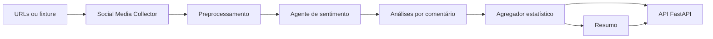

# Agente de análise de sentimento em redes sociais

Exemplo executável de uma plataforma de análise de reações **expressas em
comentários**. O projeto recebe publicações e comentários por meio de collectors
desacoplados, preserva sinais linguísticos (emojis, negações e pontuação), produz
análises estruturadas por comentário e calcula estatísticas por código.

> O sistema não diagnostica pessoas nem infere estado psicológico. Ele descreve
> somente o sentimento, emoção e tom presentes no texto fornecido.

## Fluxo



## O que está implementado

- `MockSocialMediaCollector` para execução integral sem acesso a rede social;
- interface para collectors reais, sem crawler ou bypass de controles;
- limpeza, deduplicação e marcação de spam básica;
- provedores de análise intercambiáveis: `groq` (LLM com JSON estruturado) e
  `heuristic` (modo local, transparente e destinado a demonstração/testes);
- concorrência limitada, lote configurável e cache em memória por hash;
- sentimento, emoções, intensidade, ironia, tópicos, confiança e contexto
  insuficiente por comentário;
- percentuais, emoções e matriz tópico × sentimento calculados deterministicamente;
- CLI, endpoint FastAPI e testes unitários.

## Instalação

Na raiz deste projeto:

```powershell
python -m venv .venv
.\.venv\Scripts\python.exe -m pip install -r requirements.txt
Copy-Item .env.example .env
```

Para usar a análise LLM real, preencha `GROQ_API_KEY` no `.env`. Sem chave, use
explicitamente `--provider heuristic`; esse modo não faz chamadas externas e não
deve ser confundido com uma classificação por LLM.

## Executar

```powershell
# Demonstração local reproduzível
python -m app.cli analyze --fixture tests/fixtures/post.json --provider heuristic

# Análise real com Groq
python -m app.cli analyze --fixture tests/fixtures/post.json --provider groq

# Salvar o JSON final
python -m app.cli analyze --fixture tests/fixtures/post.json --provider heuristic --output resultado.json

# API
uvicorn app.main:app --reload
```

Com a API ativa, envie o caminho da fixture para `POST /analysis`:

```json
{"fixture": "tests/fixtures/post.json", "provider": "heuristic"}
```

O `POST /analysis` retorna um `analysis_id` temporário. Use-o em
`GET /analysis/{analysis_id}`, `/comments`, `/summary` ou `/topics`. O endpoint
`POST /posts/collect` demonstra a etapa de coleta usando a mesma fixture.

## Estrutura

```text
app/
├── agents/          # provedores e prompts
├── collectors/      # interface, registro e collector mock
├── preprocessing/   # normalização e deduplicação
├── services/        # pipeline assíncrono
├── aggregation.py   # métricas determinísticas
├── models.py        # schemas Pydantic
├── cli.py
└── main.py
tests/
└── fixtures/post.json
```

## Limitações e evolução

Esta é a Fase 1 do exemplo. A coleta é apenas por fixture; uma plataforma real
deve ser adicionada como novo collector usando API oficial, respeitando os termos,
paginação e limites. Não há persistência, dashboard ou banco nesta versão.
O cache é em memória e só vale durante uma execução.

Os resultados representam exclusivamente os comentários coletados/analisados e
não a opinião da população ou de todos os usuários.
